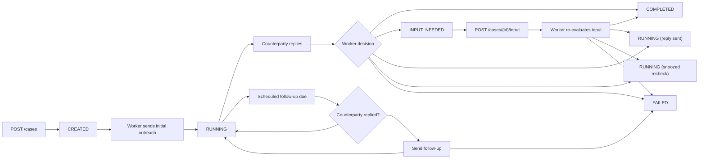

Offload cases are async. `POST /cases` only stores the case and queues work. The actual outreach, follow-up, and reply analysis happen later in the worker.

## Statuses

| Status | Set by | Meaning |
| --- | --- | --- |
| `CREATED` | `POST /cases` | The case was accepted and queued. No outreach has been sent yet. |
| `RUNNING` | Worker | Offload has sent the initial outreach or is actively managing the thread. |
| `INPUT_NEEDED` | Worker | Offload cannot continue without a human answer from your app. |
| `COMPLETED` | Worker | The goal was achieved and `result` is available. |
| `FAILED` | Worker or AgentMail event handler | The case cannot continue. |

## End-To-End Flow

## What Happens After Creation

1. `POST /cases` stores the case with `status: "CREATED"` and `attemptCount: 0`.
2. The API enqueues a `CASE_CREATED` worker event.
3. The worker generates the initial outreach.
4. If the send succeeds:
   - `status` becomes `RUNNING`
   - `attemptCount` becomes `1`
   - `nextActionAt` is scheduled using `followUpDelayHours`
5. If the send fails with a terminal provider error, the case becomes `FAILED`.

## How Follow-Ups Work

The code runs a cron job every hour to find due `RUNNING` cases and queue follow-up work.

When a follow-up event is processed:

- if the counterparty already replied, Offload clears the schedule and waits for reply evaluation
- if no reply exists and the follow-up budget is exhausted, the case becomes `FAILED` with `resultStatus: "max_retries"`
- otherwise Offload sends another email and increments `attemptCount`

### Retry Counting

- `attemptCount` counts outbound messages
- `maxAttempts` counts only automated follow-ups after the first message

Example:

- after initial outreach: `attemptCount = 1`
- after two follow-ups: `attemptCount = 3`

## How Reply Evaluation Works

When AgentMail reports a reply in the tracked thread, the worker evaluates the thread and the latest reply. The evaluation can lead to:

- `GOAL_ACHIEVED` -> case becomes `COMPLETED`
- `FAILED_REJECTED` -> case becomes `FAILED`
- `INPUT_NEEDED` -> case becomes `INPUT_NEEDED` and emits `case.input_needed`
- `REQUIRES_REPLY` -> Offload replies in-thread and stays `RUNNING`
- `SNOOZE` -> Offload schedules a later recheck and stays `RUNNING`

## Human-In-The-Loop Flow

When the worker needs your input:

1. the case becomes `INPUT_NEEDED`
2. Offload stores `inputRequest`, `inputRequestId`, `inputRequestStatus: "PENDING"`, and `inputRequestedAt`
3. Offload sends `case.input_needed` if `clientWebhookUrl` is configured
4. your app submits an answer with `POST /cases/{id}/input`
5. the API accepts the answer asynchronously and queues worker processing

There is no webhook for "input accepted" or "case resumed". You only receive the next `case.completed`, `case.failed`, or `case.input_needed`.

## Terminal Outcomes

Known terminal `resultStatus` values produced by the implementation include:

| `status` | Known `resultStatus` values |
| --- | --- |
| `COMPLETED` | `goal_achieved` |
| `FAILED` | `max_retries`, `failed_rejected`, `BOUNCED`, `COMPLAINED`, `REJECTED` |

Treat `resultStatus` as an open string rather than a closed enum. The current code mixes lowercase workflow values and uppercase provider-delivery values.

## Async Guarantees

Internal worker processing is closer to at-least-once than exactly-once:

- events are queued through SQS
- the worker claims events by idempotency key
- completed and in-progress duplicates are skipped

Webhook delivery is weaker:

- Offload sends a single outbound HTTP request
- a failed webhook is only logged
- the application does not retry delivery

For high-confidence integrations, use webhooks plus periodic polling reconciliation.
