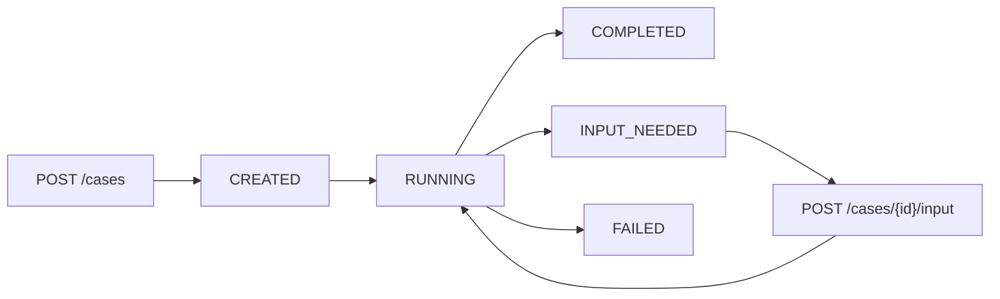

## Statuses

| Status | Meaning |
| --- | --- |
| `CREATED` | The case was accepted and queued. |
| `RUNNING` | Offload is actively managing outreach, replies, or follow-ups. |
| `INPUT_NEEDED` | Offload is blocked on a human decision or missing fact from your app. |
| `COMPLETED` | The goal was achieved and `result` is available. |
| `FAILED` | The workflow could not complete. |

## Typical flow

## What changes state

- Case creation moves a case into `CREATED`.
- Async processing sends the initial outreach and moves the case into active execution.
- Inbound replies are evaluated to decide whether the case is complete, failed, needs a reply, or needs human input.
- Scheduled follow-ups continue until the counterparty replies or the retry budget is exhausted.
- Human input resumes a paused case through `POST /cases/{id}/input`.

## Terminal outcomes

### `COMPLETED`

Use the webhook `case.completed` as your primary trigger to consume structured output.

Typical values:

- `status: "COMPLETED"`
- `resultStatus: "goal_achieved"`
- `result: { ... }`

### `FAILED`

Failures can happen because:

- the maximum follow-up attempts were reached
- the provider bounced, rejected, or complained
- the counterparty explicitly rejected the request
- the workflow could not continue

Inspect:

- `resultStatus`
- `failureReason`

## Human-in-the-loop behavior

When Offload needs a decision, it emits `case.input_needed` and pauses the workflow.

Important detail:

- the webhook includes `inputRequest` and `inputRequestId`
- `GET /cases/{id}` currently reflects the `INPUT_NEEDED` status but does not include those input-request fields

If you need to resume correctly, store the webhook payload.
